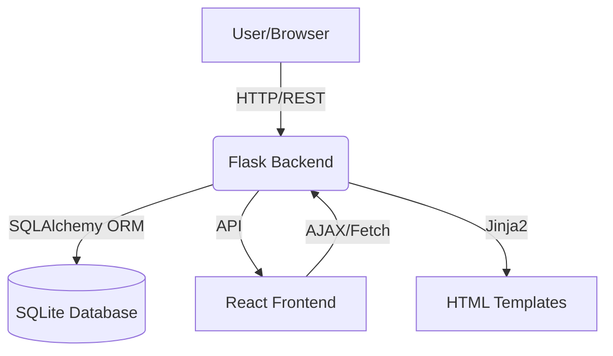
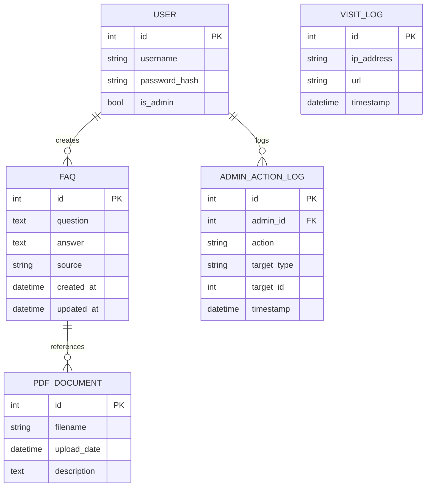

# Project Report: FAQ-IA

## Overview
FAQ-IA is a full-stack FAQ management system with an AI-ready backend (Flask, SQLAlchemy) and a React-based frontend. It supports CRUD operations, bulk FAQ upload via JSON, and user/admin management.

---

## Architecture Diagram



---

## Database Schema



---

## Backend Features
- **Flask REST API**: Endpoints for FAQ CRUD, JSON upload, PDF management, and logging.
- **Bulk Upload**: `/api/faq/upload` accepts a JSON file with an array of FAQs.
- **Database**: SQLAlchemy models for all entities, Alembic for migrations.
- **Blueprints**: Modular code for FAQ, PDF, and Hello endpoints.
- **Jinja2 Templates**: For server-rendered pages (e.g., upload form).

## Frontend Features
- **React SPA**: FAQ listing, upload UI, progress bar, and redirects.
- **AJAX Upload**: Uses XMLHttpRequest for file upload with progress feedback.
- **Responsive Design**: Built with Create React App.

## Example FAQ Upload JSON
```json
[
  {"question": "What is FAQ-IA?", "answer": "A FAQ management system.", "source": "manuel"},
  {"question": "How to upload?", "answer": "Use the upload page.", "source": "ia"}
]
```

## Example Upload Flow
1. User visits `/faq/upload` (Jinja2 template).
2. Selects a JSON file and submits.
3. Progress bar updates as file uploads.
4. On success, user is redirected to `/faq`.

---

## Deployment
- **Backend**: `python3 backend/app.py`
- **Frontend**: `npm start` in `frontend/`
- **Production**: Use `nginx.conf` for reverse proxy setup.

## Engineering Notes
- Flask-SQLAlchemy for ORM, Alembic for migrations.
- All API endpoints are under `/api/faq`.
- Upload endpoint expects a JSON array of objects with `question` and `answer`.
- Visit and admin logs for auditing.

## Authors
# - [@The](https://github.com/TheMonster)
- [@ValentinKt](https://github.com/ValentinKt)

